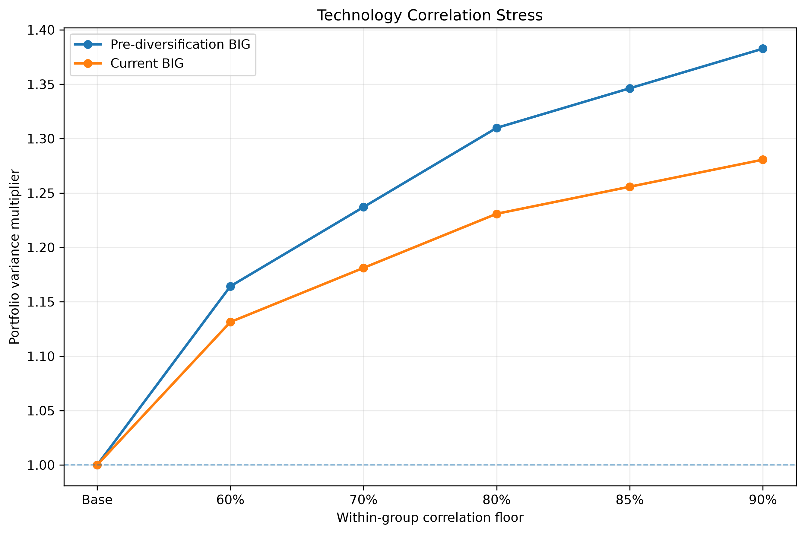
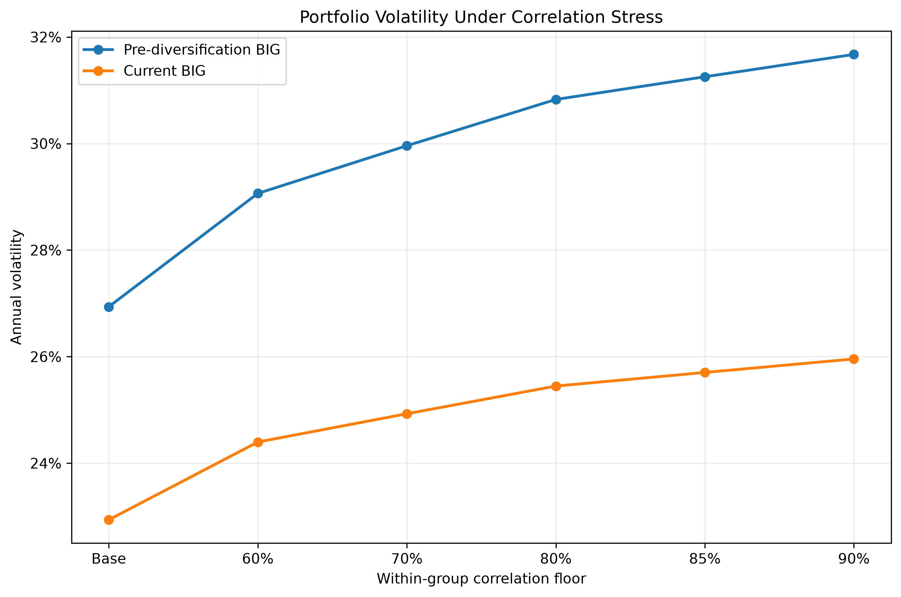
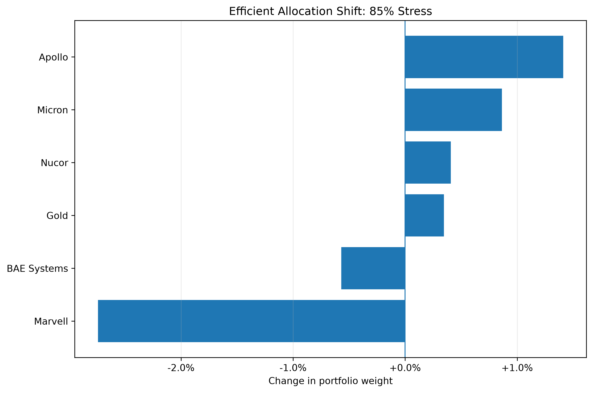

# Case-study results

The current and pre-diversification BIG snapshots have different exposure to the configured technology/growth group:

| Portfolio snapshot | Technology/growth exposure |
| --- | ---: |
| Current | 27.5% |
| Pre-diversification | 35.0% |

Under an 85% within-group correlation floor, the verified results are:

| Portfolio snapshot | Base volatility | Stressed volatility | Variance increase |
| --- | ---: | ---: | ---: |
| Current | 22.94% | 25.70% | 25.6% |
| Pre-diversification | 26.94% | 31.25% | 34.6% |

The stress-induced volatility increases are approximately

$$
25.70\%-22.94\%=2.76
\text{ percentage points}
$$

for the current portfolio and

$$
31.25\%-26.94\%=4.31
\text{ percentage points}
$$

for the pre-diversification portfolio.

The reduction in the stress-induced increase is therefore approximately

$$
1-\frac{2.76}{4.31}
\approx 36\%.
$$

Under this specified correlation stress, the current portfolio has both lower base volatility and a smaller increase in volatility. The calculation is conditional on the estimated covariance structure and the imposed 85% floor; it is not a forecast of a future market event.

