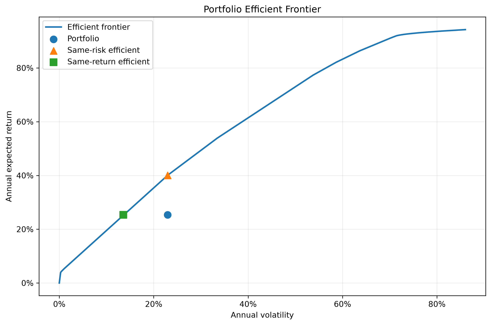

# BIG Portfolio Optimisation

An end-to-end portfolio optimisation and risk-analysis project developed around the real holdings of Bath Investors Group (BIG). The framework converts multi-currency market data into GBP, estimates annual return and covariance inputs from weekly observations, solves long-only mean-variance problems with MOSEK Fusion, and measures the sensitivity of portfolio risk to higher within-group correlations.

The repository is intended to show the full modelling process, including the assumptions that enter before the optimiser is called. Expected returns, covariance, currency treatment and stress construction all affect the final allocation, so each stage is kept explicit.

## Methodology

The analysis proceeds in six stages:

1. Download adjusted market prices and the required FX series.
2. Convert all risky assets into GBP.
3. Apply configured historical proxies where an asset has insufficient observed history.
4. Construct complete weekly log-return scenarios.
5. Estimate annual arithmetic expected returns and covariance.
6. Evaluate the observed portfolio, solve mean-variance alternatives, and apply correlation stresses.

Portfolio definitions, currencies, proxies and risk groups are stored in `config/portfolio.yaml`. The current configuration contains separate `current` and `pre_diversification` portfolio snapshots, allowing the same model to compare the two allocations.